# Firefly Core Banking Cards Service

## 📑 Table of Contents

- [Overview](#-overview)
- [Key Features](#-key-features)
- [Business Value](#-business-value)
- [Architecture](#-architecture)
  - [Module Structure](#-module-structure)
  - [Technology Stack](#-technology-stack)
  - [Design Patterns](#-design-patterns)
- [Data Model](#-data-model)
  - [Entity Relationship Diagram](#detailed-entity-relationship-diagram)
  - [Main Entity Categories](#main-entity-categories)
- [API Reference](#-api-reference)
- [Getting Started](#-getting-started)
  - [Prerequisites](#prerequisites)
  - [Quick Start](#quick-start)
  - [Configuration](#configuration)
- [SDK Generation](#-sdk-generation)
  - [SDK Features](#sdk-features)
  - [How to Generate the SDK](#how-to-generate-the-sdk)
  - [Using the SDK](#using-the-sdk)
- [Development](#-development)
  - [Project Structure](#project-structure)
  - [Build Commands](#build-commands)
  - [Testing Strategy](#testing-strategy)
- [Deployment](#-deployment)
  - [Docker Deployment](#docker-deployment)
  - [Environment Profiles](#environment-profiles)
- [Monitoring](#-monitoring)
- [Security](#-security)
- [Contributing](#-contributing)
- [License](#-license)

## 📋 Overview

The Core Banking Cards Service is a comprehensive microservice for the Firefly banking platform that provides end-to-end management of payment cards. This service enables financial institutions to issue, manage, and process transactions for both physical and virtual payment cards across multiple card networks and payment processors.

For detailed documentation on the main use cases, please refer to the [documentation](docs/index.md). For information about the API design principles and patterns, see the [API Design Guide](docs/api-design.md).

### ✨ Key Features

- **Card Program Management**: Define and manage card programs with specific rules, limits, and features
- **Card Issuance**: Issue physical and virtual cards to parties
- **Transaction Processing**: Authorize, process, and monitor card transactions
- **Dispute Handling**: Process and resolve transaction disputes
- **Card Security**: Implement fraud detection and prevention measures
- **Reporting and Analytics**: Generate comprehensive reports on card usage and performance

### 💼 Business Value

- **Increased Revenue**: Enable financial institutions to offer diverse card products and monetize transactions
- **Operational Efficiency**: Streamline card management processes and reduce manual intervention
- **Enhanced Party Experience**: Provide seamless card issuance, activation, and usage experience
- **Reduced Fraud**: Implement robust security measures to detect and prevent fraudulent activities
- **Regulatory Compliance**: Ensure adherence to industry standards and regulatory requirements
- **Market Agility**: Quickly launch new card products and adapt to changing market demands

## 🏗️ Architecture

The Core Banking Cards Service follows a microservice architecture pattern, designed to be independently deployable, scalable, and maintainable. The service is built using a reactive programming model to handle high throughput with minimal resource consumption.

```
┌─────────────────────────────────────────────────────────────────┐
│                      API Gateway / Load Balancer                │
└───────────────────────────────┬─────────────────────────────────┘
                                │
                                ▼
┌─────────────────────────────────────────────────────────────────┐
│                    Core Banking Cards Service                   │
│                                                                 │
│  ┌─────────────────┐  ┌─────────────────┐  ┌─────────────────┐  │
│  │   Web Layer     │  │  Service Layer  │  │    Data Layer   │  │
│  │  (Controllers)  │──▶│   (Services)   │──▶│ (Repositories) │  │
│  └─────────────────┘  └─────────────────┘  └─────────────────┘  │
│                                                                 │
└───────────────────────────────┬─────────────────────────────────┘
                                │
                                ▼
┌─────────────────────────────────────────────────────────────────┐
│                          Database                               │
└─────────────────────────────────────────────────────────────────┘
```

The service communicates with other microservices through synchronous REST APIs and asynchronous event-driven messaging. It integrates with external payment processors and card networks through dedicated adapters and gateways.

### 📦 Module Structure

The service is organized into the following modules:

| Module | Description |
|--------|-------------|
| **core-banking-cards-interfaces** | DTOs, enums, and API interfaces that define the service contract |
| **core-banking-cards-models** | Domain entities, database repositories, and data access logic |
| **core-banking-cards-core** | Business logic, service implementations, and domain-specific rules |
| **core-banking-cards-web** | REST controllers, API configuration, security settings, and application entry point |
| **core-banking-cards-sdk** | Client SDK generated from OpenAPI specification for easy integration with the service |

### 🛠️ Technology Stack

| Category | Technologies |
|----------|--------------|
| **Language & Framework** | Java 21 (with Virtual Threads), Spring Boot 3.2 |
| **API Layer** | Spring WebFlux (reactive programming) |
| **Data Access** | Spring Data R2DBC (reactive database connectivity) |
| **Database** | PostgreSQL, Flyway (migrations) |
| **Build & Deployment** | Maven, Docker |
| **Documentation** | SpringDoc OpenAPI |
| **Testing** | JUnit 5, Mockito, TestContainers |
| **Monitoring** | Micrometer, Prometheus |

### 🧩 Design Patterns

- **Hexagonal Architecture**: Separates core business logic from external concerns
- **Repository Pattern**: Abstracts data access logic
- **Mapper Pattern**: Converts between domain entities and DTOs
- **Factory Pattern**: Creates complex objects
- **Strategy Pattern**: Implements different algorithms for card processing
- **Observer Pattern**: Implements event-driven communication
- **Circuit Breaker Pattern**: Handles failures in external service calls

## 📊 Data Model

The Core Banking Cards Service has a comprehensive data model that supports the full lifecycle of card management. The model is designed to handle various card types, transaction processing, and party interactions.

### Detailed Entity Relationship Diagram

```mermaid
erDiagram
    CARD_NETWORK {
        Long card_network_id PK
        String network_name
        String network_code
        String network_logo_url
        String support_contact
        String api_endpoint
        Boolean is_active
    }

    CARD_TYPE {
        Long card_type_id PK
        String type_name
        String type_code
        Boolean is_credit
        Boolean is_debit
        Boolean is_prepaid
        Boolean is_virtual
        Boolean is_commercial
        Boolean is_gift
        Double default_credit_limit
        Double default_daily_limit
        Boolean is_active
    }

    ISSUER {
        Long issuer_id PK
        String issuer_name
        String issuer_code
        String country_code
        String contact_email
        String contact_phone
        Boolean is_active
    }

    BIN {
        Long bin_id PK
        String bin_number
        Integer bin_length
        Long issuer_id FK
        Long card_network_id FK
        Long card_type_id FK
        String country_code
        String currency_code
        Boolean is_active
    }

    CARD_DESIGN {
        Long design_id PK
        String design_name
        String design_code
        String front_image_url
        String back_image_url
        Long card_type_id FK
        Long issuer_id FK
        Long card_network_id FK
        Boolean is_customizable
        Boolean is_default
        Boolean is_active
    }

    CARD_PROGRAM {
        Long program_id PK
        String program_name
        String program_code
        Long issuer_id FK
        Long bin_id FK
        Long card_type_id FK
        Long card_network_id FK
        Long default_design_id FK
        DateTime start_date
        DateTime end_date
        Boolean is_active
        Integer max_cards_per_party
        Double default_daily_limit
        Double default_monthly_limit
        Double default_credit_limit
        Boolean supports_physical_cards
        Boolean supports_virtual_cards
        String currency_code
    }

    CARD {
        Long card_id PK
        String card_number
        String masked_card_number
        String card_sequence_number
        Long bin_id FK
        Long card_type_id FK
        Long card_network_id FK
        Long issuer_id FK
        Long contract_id
        Long account_id
        Long party_id
        CardStatusEnum card_status
        String card_holder_name
        String card_holder_id
        Integer expiration_month
        Integer expiration_year
        String cvv
        String pin
        DateTime activation_date
        DateTime issuance_date
        DateTime expiration_date
        DateTime last_used_date
        Boolean is_physical
        Boolean is_virtual
        Boolean is_primary
        Boolean is_active
        Boolean is_locked
        String lock_reason
        Double daily_limit
        Double monthly_limit
        Double credit_limit
        Double available_balance
        String currency_code
        Long design_id FK
        String notes
    }

    PHYSICAL_CARD {
        Long physical_card_id PK
        Long card_id FK
        String embossed_name
        String plastic_id
        Long design_id FK
        Boolean is_contactless
        Boolean is_chip
        Boolean is_magstripe
        ManufacturingStatusEnum manufacturing_status
        DateTime manufacturing_date
        String shipping_address
        String shipping_city
        String shipping_state
        String shipping_country
        String shipping_postal_code
        ShippingMethodEnum shipping_method
        String shipping_tracking_number
        String shipping_carrier
        DateTime shipment_date
        DateTime estimated_delivery_date
        DateTime actual_delivery_date
        ActivationMethodEnum activation_method
        DateTime activation_date
        Boolean is_activated
        String replacement_reason
        Long previous_card_id FK
        String notes
    }

    VIRTUAL_CARD {
        Long virtual_card_id PK
        Long card_id FK
        String device_id
        String device_type
        String device_model
        String device_os
        String device_os_version
        String wallet_provider
        String wallet_account_id
        String tokenization_provider
        String token_id
        DateTime token_expiry_date
        String token_status
        String virtual_card_number
        VirtualCardStatusEnum virtual_card_status
        Boolean is_default_for_device
        Boolean is_default_for_wallet
        Boolean is_provisioned
        DateTime provisioning_date
        DateTime last_used_date
        DateTime creation_timestamp
        DateTime update_timestamp
        DateTime deactivation_date
        String deactivation_reason
        String notes
    }

    CARD_BALANCE {
        Long balance_id PK
        Long card_id FK
        Double available_balance
        Double ledger_balance
        Double pending_authorizations
        Double credit_limit
        Double available_credit
        String currency_code
        DateTime last_update_timestamp
    }

    CARD_TRANSACTION {
        Long transaction_id PK
        Long card_id FK
        String transaction_reference
        String external_reference
        Double amount
        String currency_code
        DateTime transaction_timestamp
        DateTime authorization_timestamp
        DateTime settlement_timestamp
        TransactionTypeEnum transaction_type
        TransactionStatusEnum transaction_status
        String merchant_name
        String merchant_category_code
        String merchant_id
        String terminal_id
        Boolean is_international
        Boolean is_recurring
        Boolean is_atm_withdrawal
        Boolean is_online
        Boolean is_contactless
        String response_code
        String authorization_code
    }

    CARD_MERCHANT {
        Long merchant_id PK
        String merchant_reference
        String merchant_name
        String merchant_legal_name
        String merchant_category_code
        String merchant_category_name
        MerchantTypeEnum merchant_type
        MerchantStatusEnum merchant_status
        Boolean is_active
        String tax_id
        String website_url
        String logo_url
        String address_line1
        String city
        String country
        String phone
        String email
        Boolean is_online
        Boolean is_physical
        Boolean is_international
        RiskRatingEnum risk_rating
        Integer risk_score
    }

    CARD_TERMINAL {
        Long terminal_id PK
        String terminal_reference
        String terminal_serial_number
        String terminal_name
        TerminalTypeEnum terminal_type
        String terminal_model
        String terminal_manufacturer
        TerminalStatusEnum terminal_status
        Boolean is_active
        Long merchant_id FK
        String merchant_name
        String address_line1
        String city
        String country
        String acquirer_id
        String acquirer_name
        String processor_id
        Boolean is_contactless
        Boolean is_chip
        Boolean is_magstripe
        Boolean is_pin_supported
    }

    CARD_DISPUTE {
        Long dispute_id PK
        Long card_id FK
        Long transaction_id FK
        Long party_id
        Long account_id
        String dispute_reference
        String provider_reference
        String network_reference
        String dispute_reason_code
        DisputeStatusEnum dispute_status
        DisputeStageEnum dispute_stage
        Double dispute_amount
        String dispute_currency
        DateTime filing_timestamp
        DateTime resolution_timestamp
        String resolution_code
        Boolean is_cardholder_credited
        DateTime credit_timestamp
        Double credit_amount
        String cardholder_statement
        String merchant_response
    }

    CARD_STATEMENT {
        Long statement_id PK
        Long card_id FK
        Long party_id
        Long account_id
        String statement_reference
        DateTime statement_date
        DateTime statement_period_start
        DateTime statement_period_end
        DateTime due_date
        Decimal closing_balance
        Decimal opening_balance
        Decimal minimum_payment_due
        Decimal total_payment_due
        String currency_code
        Decimal total_purchases
        Decimal total_cash_advances
        Decimal total_fees
        Decimal total_interest
        PaymentStatusEnum payment_status
        Boolean is_generated
        DeliveryMethodEnum delivery_method
    }

    CARD_PAYMENT {
        Long payment_id PK
        Long card_id FK
        Long party_id
        Long account_id
        Long statement_id FK
        String payment_reference
        String external_reference
        Decimal payment_amount
        String currency_code
        PaymentMethodEnum payment_method
        PaymentChannelEnum payment_channel
        PaymentStatusEnum payment_status
        DateTime payment_timestamp
        DateTime posting_timestamp
        Boolean is_auto_payment
        Boolean is_minimum_payment
        Boolean is_full_payment
    }



    CARD_ACTIVITY {
        Long activity_id PK
        Long card_id FK
        Long party_id
        Long account_id
        String activity_reference
        ActivityTypeEnum activity_type
        String activity_category
        String activity_description
        DateTime activity_timestamp
        String activity_channel
        ActivityStatusEnum activity_status
        String activity_result
        String previous_value
        String new_value
        String change_reason
        Boolean is_party_initiated
        Boolean is_system_initiated
        Boolean is_successful
    }

    CARD_LIMIT {
        Long limit_id PK
        Long card_id FK
        Long party_id
        String limit_type
        Double limit_value
        String currency_code
        Boolean is_active
        DateTime effective_from
        DateTime effective_to
        String frequency
        Boolean is_default
        String channel
        String transaction_type
    }

    CARD_FEE {
        Long fee_id PK
        Long card_id FK
        Long program_id FK
        String fee_type
        String fee_name
        Double fee_amount
        String currency_code
        String frequency
        Boolean is_active
        DateTime effective_from
        DateTime effective_to
        Boolean is_waived
        String waiver_reason
    }

    CARD_INTEREST {
        Long interest_id PK
        Long card_id FK
        Long program_id FK
        String interest_type
        Double interest_rate
        Double annual_percentage_rate
        String calculation_method
        String application_frequency
        Boolean is_active
        DateTime effective_from
        DateTime effective_to
    }

    CARD_REWARD {
        Long reward_id PK
        Long card_id FK
        Long transaction_id FK
        Long party_id
        Long account_id
        Long program_id FK
        String reward_reference
        String reward_type
        String reward_category
        String reward_description
        String reward_status
        Boolean is_earning
        Boolean is_redemption
        Boolean is_adjustment
        Boolean is_expiration
        Decimal points_earned
        Decimal points_redeemed
        Decimal points_adjusted
        Decimal points_expired
        Decimal points_balance
        Decimal cash_value
        String currency_code
        Decimal earning_rate
        Decimal earning_multiplier
        String earning_reason
        String redemption_type
        String redemption_description
        Decimal redemption_value
        String adjustment_reason
        String adjustment_description
        String merchant_id
        String merchant_name
        String merchant_category
        Decimal transaction_amount
        String transaction_currency
        DateTime transaction_date
        DateTime posting_date
        DateTime expiration_date
        Boolean is_promotional
        Long promotion_id FK
        String promotion_name
        Boolean is_transferable
        Long transfer_to_party_id
        Long transfer_from_party_id
        DateTime transfer_date
        Boolean is_redeemed
        DateTime redemption_date
        String notes
    }

    CARD_PROMOTION {
        Long promotion_id PK
        Long card_id FK
        Long program_id FK
        String promotion_code
        String promotion_name
        String promotion_description
        DateTime start_date
        DateTime end_date
        Boolean is_active
        String promotion_type
        Double discount_percentage
        Double discount_amount
        String currency_code
    }

    BIN ||--o{ CARD : "has"
    CARD_TYPE ||--o{ CARD : "has"
    CARD_NETWORK ||--o{ CARD : "has"
    ISSUER ||--o{ CARD : "has"
    CARD_DESIGN ||--o{ CARD : "has"

    CARD_NETWORK ||--o{ BIN : "has"
    CARD_TYPE ||--o{ BIN : "has"
    ISSUER ||--o{ BIN : "has"

    CARD_TYPE ||--o{ CARD_DESIGN : "has"
    ISSUER ||--o{ CARD_DESIGN : "has"
    CARD_NETWORK ||--o{ CARD_DESIGN : "has"

    ISSUER ||--o{ CARD_PROGRAM : "has"
    BIN ||--o{ CARD_PROGRAM : "has"
    CARD_TYPE ||--o{ CARD_PROGRAM : "has"
    CARD_NETWORK ||--o{ CARD_PROGRAM : "has"
    CARD_DESIGN ||--o{ CARD_PROGRAM : "has"

    CARD ||--o{ PHYSICAL_CARD : "has"
    CARD_DESIGN ||--o{ PHYSICAL_CARD : "has"
    PHYSICAL_CARD ||--o{ PHYSICAL_CARD : "replaces"

    CARD ||--o{ VIRTUAL_CARD : "has"

    CARD ||--o{ CARD_BALANCE : "has"

    CARD ||--o{ CARD_TRANSACTION : "has"

    CARD_MERCHANT ||--o{ CARD_TRANSACTION : "processes"

    CARD_TERMINAL ||--o{ CARD_TRANSACTION : "processes"
    CARD_MERCHANT ||--o{ CARD_TERMINAL : "has"

    CARD ||--o{ CARD_DISPUTE : "has"
    CARD_TRANSACTION ||--o{ CARD_DISPUTE : "has"

    CARD ||--o{ CARD_STATEMENT : "has"

    CARD ||--o{ CARD_PAYMENT : "has"
    CARD_STATEMENT ||--o{ CARD_PAYMENT : "has"

    CARD ||--o{ CARD_ACTIVITY : "has"

    CARD ||--o{ CARD_LIMIT : "has"

    CARD ||--o{ CARD_FEE : "has"
    CARD_PROGRAM ||--o{ CARD_FEE : "has"

    CARD ||--o{ CARD_INTEREST : "has"
    CARD_PROGRAM ||--o{ CARD_INTEREST : "has"

    CARD ||--o{ CARD_REWARD : "has"
    CARD_PROGRAM ||--o{ CARD_REWARD : "has"

    CARD ||--o{ CARD_PROMOTION : "has"
    CARD_PROGRAM ||--o{ CARD_PROMOTION : "has"
```



### Main Entity Categories

#### 🏦 Core Entities
- **Card Program**: Defines rules and configurations for a group of cards
- **Card Type**: Specifies card characteristics (credit, debit, prepaid)
- **Card Network**: Represents payment networks (Visa, Mastercard, etc.)
- **Issuer**: Financial institutions that issue cards
- **BIN**: Bank Identification Number that identifies issuer and card type

#### 💳 Card Entities
- **Card**: Central entity representing a payment card
- **Physical Card**: Physical aspects including manufacturing and shipping details
- **Virtual Card**: Digital version for online transactions and mobile wallets
- **Card Configuration**: Settings for individual cards
- **Card Balance**: Tracks available funds and balances

#### 💰 Transaction Entities
- **Card Transaction**: Records of financial transactions
- **Card Statement**: Periodic statements of card activity
- **Card Payment**: Payments made towards card balances
- **Card Dispute**: Disputes filed against transactions

#### 👥 Merchant Entities
- **Card Merchant**: Businesses accepting card payments
- **Card Terminal**: Payment terminals for processing transactions
- **Card Acquirer**: Financial institutions processing merchant payments
- **Card Processor**: Entities processing transactions between parties

## 🔌 API Reference

The Core Banking Cards Service exposes RESTful endpoints for managing cards and related entities. All endpoints follow REST principles and use standard HTTP methods.

### API Categories

| Category | Description |
|----------|-------------|
| **BIN Management** | APIs for managing Bank Identification Number (BIN) records |
| **Card Program Management** | APIs for managing card program records |
| **Card Management** | APIs for managing card records |
| **Merchant Management** | APIs for managing merchant records |
| **Transaction Management** | APIs for managing transaction records |
| **Dispute Management** | APIs for managing dispute records |

### Example: Creating a New Card

```http
POST /api/v1/cards
Content-Type: application/json

{
  "cardNumber": "4111111111111111",
  "maskedCardNumber": "411111******1111",
  "cardSequenceNumber": "001",
  "binId": 1,
  "cardTypeId": 1,
  "cardNetworkId": 1,
  "issuerId": 1,
  "contractId": 12345,
  "accountId": 67890,
  "partyId": 54321,
  "cardStatus": "ACTIVE",
  "cardHolderName": "John Doe",
  "cardHolderId": "ID12345",
  "expirationMonth": 12,
  "expirationYear": 2028,
  "cvv": "123",
  "pin": "1234",
  "isPhysical": true,
  "isVirtual": false,
  "isPrimary": true,
  "isActive": true,
  "dailyLimit": 5000.00,
  "monthlyLimit": 20000.00,
  "creditLimit": 10000.00,
  "currencyCode": "USD",
  "designId": 1
}
```

Detailed API documentation is available in the [API Reference](docs/api-reference.md) document and at `/swagger-ui.html` when the service is running.

## 🚀 Getting Started

### Prerequisites

- JDK 21 or later
- Maven 3.8+ or later
- PostgreSQL 14+ or Docker
- Git

### Quick Start

1. **Clone the repository**
   ```bash
   git clone https://github.com/firefly-oss/core-banking-cards.git
   cd core-banking-cards
   ```

2. **Set up the database**
   ```bash
   docker run --name postgres-cards -e POSTGRES_PASSWORD=postgres -e POSTGRES_DB=cards -p 5432:5432 -d postgres:14
   ```

3. **Build and run the service**
   ```bash
   mvn clean install
   mvn spring-boot:run -pl core-banking-cards-web
   ```

4. **Access the API documentation**
   ```
   http://localhost:8080/swagger-ui.html
   ```

### Configuration

The service uses Spring Boot's configuration system with the main configuration file at `core-banking-cards-web/src/main/resources/application.yaml`.

```yaml
spring:
  r2dbc:
    url: r2dbc:postgresql://${DB_HOST:localhost}:${DB_PORT:5432}/${DB_NAME:cards}
    username: ${DB_USERNAME:postgres}
    password: ${DB_PASSWORD:postgres}
  flyway:
    enabled: true
    locations: classpath:db/migration

server:
  port: ${SERVER_PORT:8080}
```

## 🔧 SDK Generation

The Core Banking Cards Service provides a client SDK that can be used to integrate with the service. The SDK is generated automatically from the OpenAPI specification using the OpenAPI Generator Maven Plugin.

### How it Works

1. The SDK generation is integrated into the Maven build process.
2. During the build, the OpenAPI Generator Maven plugin fetches the OpenAPI specification from the running web application.
3. The plugin then generates Java client code based on this specification.
4. The generated code is included in the build and packaged with the module.

### SDK Features

- **Auto-generated Client**: The SDK provides a fully functional client for all API endpoints
- **Type-safe Models**: All DTOs are generated as type-safe Java classes
- **Reactive Support**: Uses WebClient for reactive API calls
- **Error Handling**: Comprehensive error handling and response mapping
- **Authentication**: Built-in support for authentication mechanisms

### Prerequisites

Before generating the SDK, ensure that:

1. The `core-banking-cards-web` application is running on `http://localhost:8080`.
2. The OpenAPI specification is available at `http://localhost:8080/v3/api-docs`.

### How to Generate the SDK

The SDK is generated during the build process. To generate the SDK:

1. Start the Core Banking Cards Service locally:
   ```bash
   mvn spring-boot:run -pl core-banking-cards-web
   ```

2. In a separate terminal, generate the SDK:
   ```bash
   mvn clean install -pl core-banking-cards-sdk
   ```

The generated SDK code will be available in the `core-banking-cards-sdk/target/generated-sources` directory.

### Using the SDK

To use the SDK in your project, add the following dependency to your pom.xml:

```xml
<dependency>
    <groupId>com.catalis</groupId>
    <artifactId>core-banking-cards-sdk</artifactId>
    <version>1.0.0-SNAPSHOT</version>
</dependency>
```

Example usage:

```java
// Create an instance of the API client
ApiClient apiClient = new ApiClient();
apiClient.setBasePath("http://localhost:8080");

// Create an instance of the Cards API
CardsApi cardsApi = new CardsApi(apiClient);

// Call an API method
cardsApi.getCardById(cardId)
    .subscribe(
        card -> System.out.println("Card: " + card),
        error -> System.err.println("Error: " + error)
    );
```

Another example with CardAcquirersApi:

```java
import com.catalis.core.banking.cards.sdk.api.CardAcquirersApi;
import com.catalis.core.banking.cards.sdk.invoker.ApiClient;
import com.catalis.core.banking.cards.sdk.model.CardAcquirerDTO;
import com.catalis.core.banking.cards.sdk.model.PaginationResponse;

public class Example {
    public static void main(String[] args) {
        ApiClient apiClient = new ApiClient();
        apiClient.setBasePath("http://your-api-base-url");

        CardAcquirersApi api = new CardAcquirersApi(apiClient);

        try {
            // Get all acquirers
            PaginationResponse<CardAcquirerDTO> response = api.getAllAcquirers(null);
            System.out.println("Total acquirers: " + response.getTotalElements());

            // Process the acquirers
            for (CardAcquirerDTO acquirer : response.getContent()) {
                System.out.println("Acquirer: " + acquirer.getName());
            }
        } catch (Exception e) {
            e.printStackTrace();
        }
    }
}
```

### Customizing the SDK Generation

The SDK generation is configured in the `pom.xml` file. You can customize various aspects of the generation process by modifying the configuration of the `openapi-generator-maven-plugin`.

For more information on available configuration options, refer to the [OpenAPI Generator documentation](https://github.com/OpenAPITools/openapi-generator).

## 💻 Development

### Project Structure

```
core-banking-cards/
├── core-banking-cards-interfaces/  # DTOs, enums, API interfaces
├── core-banking-cards-models/      # Domain entities, repositories
├── core-banking-cards-core/        # Business logic, services
├── core-banking-cards-web/         # Controllers, configuration
├── Dockerfile                      # Docker configuration
└── pom.xml                         # Maven parent configuration
```

### Build Commands

| Command | Description |
|---------|-------------|
| `mvn clean compile` | Clean and compile the project |
| `mvn test` | Run all tests |
| `mvn test -pl core-banking-cards-core` | Run tests for a specific module |
| `mvn package -DskipTests` | Package without running tests |
| `mvn spring-boot:run -pl core-banking-cards-web` | Run the application |

### Testing Strategy

The project implements a comprehensive testing approach:

- **Unit Tests**: Test individual components in isolation
- **Integration Tests**: Test component interactions
- **API Tests**: Test REST endpoints
- **Performance Tests**: Test system under load

## 🔄 Deployment

### Docker Deployment

```bash
# Build Docker image
docker build -t core-banking-cards:latest .

# Run Docker container
docker run -p 8080:8080 \
  -e DB_HOST=host.docker.internal \
  -e DB_PORT=5432 \
  -e DB_NAME=cards \
  -e DB_USERNAME=postgres \
  -e DB_PASSWORD=postgres \
  core-banking-cards:latest
```

### Environment Profiles

The service supports different environments through Spring profiles:
- **dev**: Development environment with detailed logging
- **test**: Testing environment with in-memory database
- **prod**: Production environment with optimized settings

```bash
java -jar app.jar --spring.profiles.active=dev
```

## 📊 Monitoring

### Health & Metrics

| Endpoint | Description |
|----------|-------------|
| `/actuator/health` | Overall health status |
| `/actuator/health/liveness` | Liveness check |
| `/actuator/health/readiness` | Readiness check |
| `/actuator/prometheus` | Prometheus metrics |

Key metrics include request count and latency, JVM memory usage, database connection pool statistics, and custom business metrics.

## 🔒 Security

- **Authentication**: JWT-based authentication
- **Authorization**: Role-based access control
- **Data Protection**: Encryption of sensitive data (card numbers, CVV, PINs)
- **Communication**: TLS for all API communications

## 👥 Contributing

We welcome contributions to the Core Banking Cards Service! Here's how you can help:

1. 🍴 **Fork the repository**
2. 🌿 **Create a feature branch** (`git checkout -b feature/amazing-feature`)
3. 💾 **Commit your changes** (`git commit -m 'Add some amazing feature'`)
4. 📤 **Push to the branch** (`git push origin feature/amazing-feature`)
5. 🔄 **Open a Pull Request**

Please make sure your code follows our coding standards and includes appropriate tests.

## 📄 License

This project is licensed under the Apache 2.0 License - see the [LICENSE](LICENSE) file for details.
