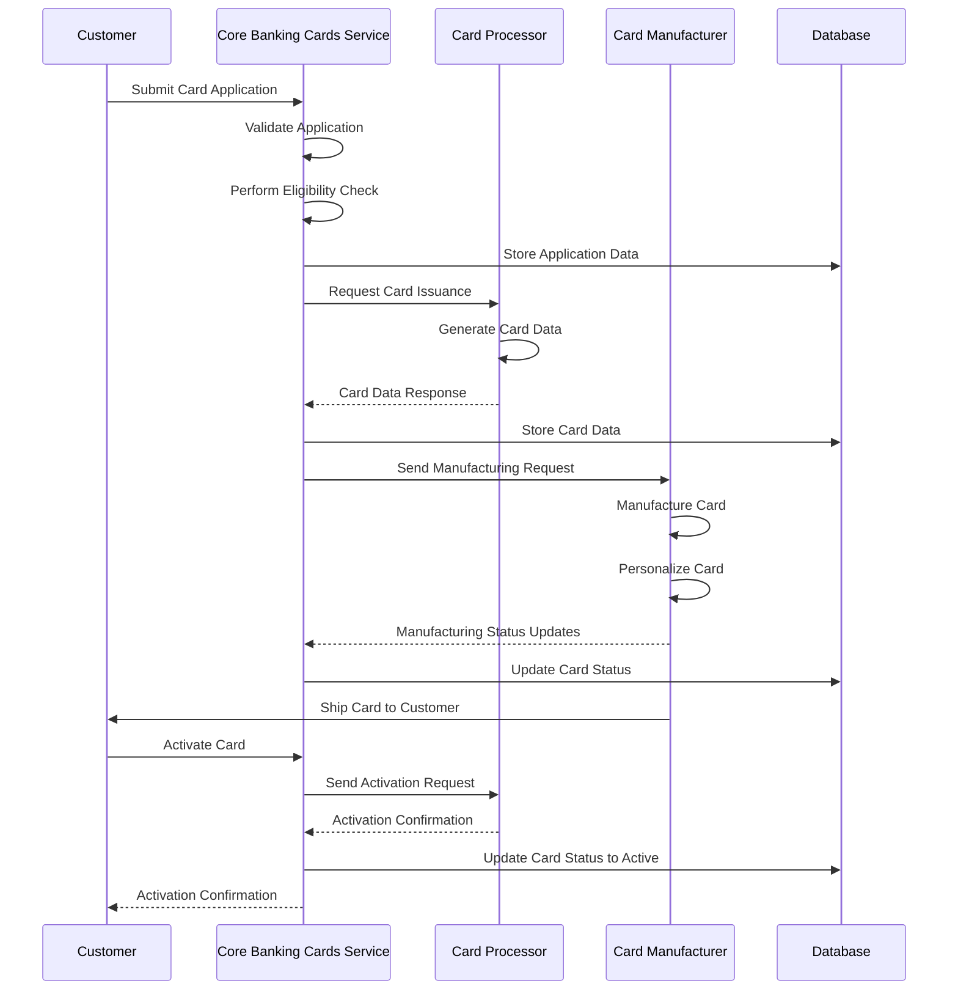
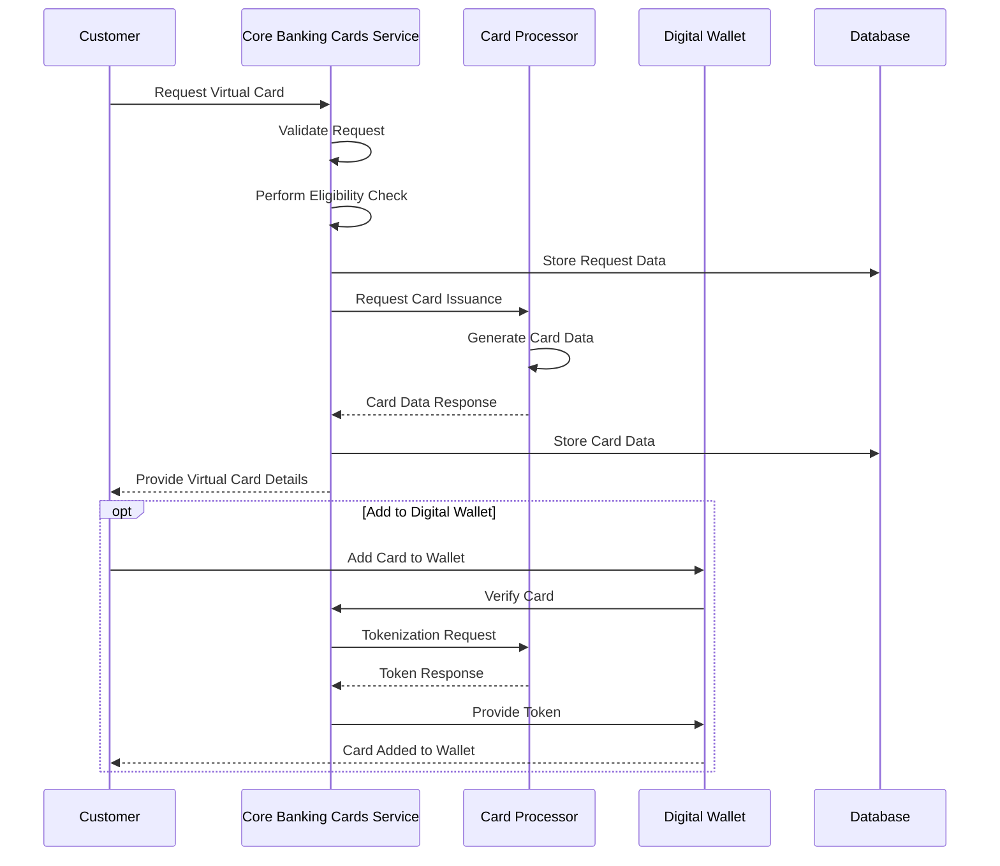

# Card Issuance

## Overview

Card Issuance is a fundamental capability of the Core Banking Cards Service that enables financial institutions to issue both physical and virtual payment cards to parties. The service manages the entire lifecycle of card issuance, from application processing to card activation.

## Key Capabilities

- Issue physical cards with personalized designs and features
- Issue virtual cards for immediate digital use
- Process card applications and perform eligibility checks
- Generate secure card data (PAN, CVV, expiration date)
- Manage card manufacturing and delivery for physical cards
- Enable card activation through multiple channels
- Support card replacement and renewal processes
- Manage card PINs securely

## Types of Card Issuance

### Physical Card Issuance

Physical card issuance involves creating a tangible payment card that is manufactured, personalized, and delivered to the party. The process includes:

1. Application processing and approval
2. Card data generation
3. Card manufacturing with personalization
4. Secure delivery to the party
5. Card activation

### Virtual Card Issuance

Virtual card issuance creates a digital payment card that can be used immediately for online transactions or added to digital wallets. The process includes:

1. Application processing and approval
2. Card data generation
3. Digital delivery of card details
4. Immediate activation
5. Optional provisioning to digital wallets (Apple Pay, Google Pay, etc.)

## Entities Involved

- **CARD**: Central entity representing a payment card
- **PHYSICAL_CARD**: Physical aspects including manufacturing and shipping details
- **VIRTUAL_CARD**: Digital version for online transactions and mobile wallets
- **CARD_PROGRAM**: Defines rules and configurations for a group of cards
- **CARD_DESIGN**: Visual design templates for cards


## Process Flow: Physical Card Issuance



## Process Flow: Virtual Card Issuance



## API Endpoints

| Endpoint | Method | Description |
|----------|--------|-------------|
| `/api/v1/cards` | POST | Issue a new card (physical or virtual) |
| `/api/v1/cards/{cardId}/activate` | POST | Activate a card |
| `/api/v1/cards/{cardId}/pin` | PUT | Set or change card PIN |
| `/api/v1/physical-cards` | POST | Issue a new physical card |
| `/api/v1/physical-cards/{cardId}/shipping` | GET | Get shipping status |
| `/api/v1/virtual-cards` | POST | Issue a new virtual card |
| `/api/v1/virtual-cards/{cardId}/provision` | POST | Provision to digital wallet |
| `/api/v1/cards/{cardId}/replace` | POST | Request card replacement |
| `/api/v1/cards/{cardId}/renew` | POST | Renew an expiring card |

## Example: Issuing a Physical Card

### Request

```
POST /api/v1/physical-cards
Content-Type: application/json
```

```json
{
  "partyId": 12345,
  "accountId": 67890,
  "programId": 101,
  "cardHolderName": "JOHN Q PUBLIC",
  "designId": 5,
  "isContactless": true,
  "shippingAddress": {
    "addressLine1": "123 Main Street",
    "city": "Anytown",
    "state": "CA",
    "postalCode": "12345",
    "country": "US"
  },
  "shippingMethod": "STANDARD",
  "activationMethod": "MOBILE_APP"
}
```

### Response

```json
{
  "cardId": 9876,
  "physicalCardId": 5432,
  "cardNumber": "************1234",
  "expirationMonth": 12,
  "expirationYear": 2027,
  "cardStatus": "PENDING",
  "manufacturingStatus": "ORDERED",
  "estimatedDeliveryDate": "2023-07-01T00:00:00Z",
  "trackingNumber": null,
  "activationUrl": "https://example.com/activate/9876",
  "dateCreated": "2023-06-15T14:30:00Z"
}
```

## Example: Issuing a Virtual Card

### Request

```
POST /api/v1/virtual-cards
Content-Type: application/json
```

```json
{
  "partyId": 12345,
  "accountId": 67890,
  "programId": 102,
  "cardHolderName": "JOHN Q PUBLIC",
  "deviceId": "device-uuid-12345",
  "deviceType": "SMARTPHONE",
  "deviceModel": "iPhone 14",
  "deviceOs": "iOS",
  "deviceOsVersion": "16.5",
  "walletProvider": "APPLE_PAY"
}
```

### Response

```json
{
  "cardId": 9877,
  "virtualCardId": 4321,
  "cardNumber": "************5678",
  "expirationMonth": 12,
  "expirationYear": 2027,
  "cvv": "***",
  "cardStatus": "ACTIVE",
  "virtualCardStatus": "ACTIVE",
  "isProvisioned": false,
  "provisioningUrl": "https://example.com/provision/9877",
  "dateCreated": "2023-06-15T14:35:00Z"
}
```

## Best Practices

1. **Security**: Implement robust security measures for card data protection
2. **Validation**: Perform thorough validation of party information before card issuance
3. **Monitoring**: Monitor card issuance processes for fraud detection
4. **Compliance**: Ensure compliance with PCI-DSS and network regulations
5. **User Experience**: Provide clear instructions for card activation and usage
6. **Testing**: Test card issuance processes thoroughly in a sandbox environment
7. **Logging**: Maintain detailed logs of all card issuance activities
8. **Notifications**: Send timely notifications to parties about card status