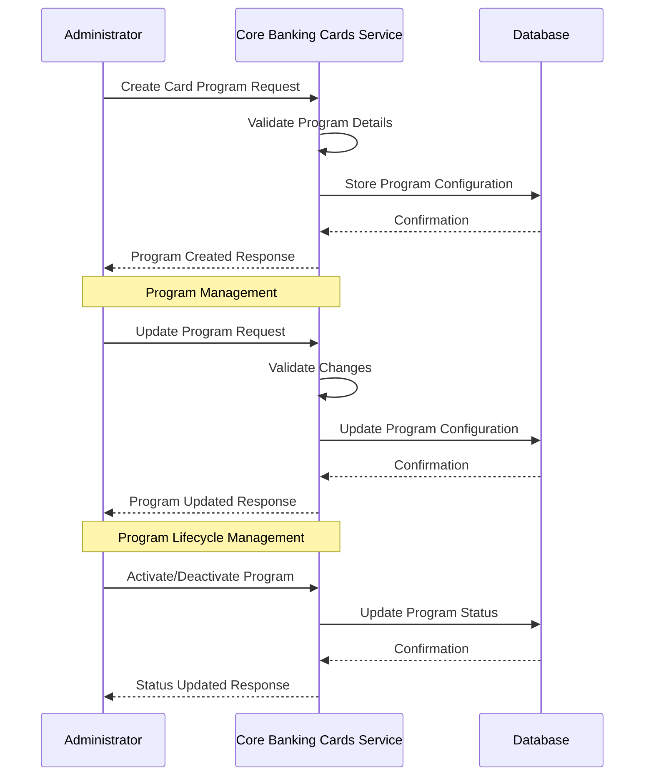

# Card Program Management

## Overview

Card Program Management is a core functionality of the Core Banking Cards Service that allows financial institutions to define and manage card programs with specific rules, limits, and features. A card program serves as a template for issuing cards to customers, ensuring consistency in card features, limits, and behavior.

## Key Capabilities

- Create and manage card programs with specific rules and configurations
- Define default card limits, fees, and interest rates
- Configure card program eligibility criteria
- Manage card program lifecycle (activation, deactivation, expiration)
- Associate card programs with specific BINs, card types, and card networks
- Configure default card designs for programs

## Entities Involved

- **CARD_PROGRAM**: Defines the card program with its rules and configurations
- **CARD_TYPE**: Specifies the type of card (credit, debit, prepaid, etc.)
- **CARD_NETWORK**: Represents the payment network (Visa, Mastercard, etc.)
- **ISSUER**: Financial institution that issues the cards
- **BIN**: Bank Identification Number that identifies the issuer and card type
- **CARD_DESIGN**: Visual design templates for cards issued under the program

## Process Flow



## API Endpoints

| Endpoint | Method | Description |
|----------|--------|-------------|
| `/api/v1/card-programs` | GET | List all card programs with pagination and filtering |
| `/api/v1/card-programs/{programId}` | GET | Get card program details by ID |
| `/api/v1/card-programs` | POST | Create a new card program |
| `/api/v1/card-programs/{programId}` | PUT | Update an existing card program |
| `/api/v1/card-programs/{programId}/status` | PATCH | Update card program status |
| `/api/v1/card-programs/{programId}/limits` | GET | Get program default limits |
| `/api/v1/card-programs/{programId}/limits` | PUT | Update program default limits |
| `/api/v1/card-programs/{programId}/fees` | GET | Get program fees |
| `/api/v1/card-programs/{programId}/fees` | PUT | Update program fees |

## Example: Creating a Card Program

### Request

```
POST /api/v1/card-programs
Content-Type: application/json
```

```json
{
  "programName": "Premium Credit Card",
  "programCode": "PREMIUM-CC-001",
  "issuerId": 1,
  "binId": 2,
  "cardTypeId": 3,
  "cardNetworkId": 1,
  "defaultDesignId": 5,
  "startDate": "2023-01-01T00:00:00Z",
  "endDate": "2028-12-31T23:59:59Z",
  "isActive": true,
  "maxCardsPerCustomer": 3,
  "defaultDailyLimit": 5000.00,
  "defaultMonthlyLimit": 25000.00,
  "defaultCreditLimit": 50000.00,
  "supportsPhysicalCards": true,
  "supportsVirtualCards": true,
  "currencyCode": "USD"
}
```

### Response

```json
{
  "programId": 101,
  "programName": "Premium Credit Card",
  "programCode": "PREMIUM-CC-001",
  "issuerId": 1,
  "binId": 2,
  "cardTypeId": 3,
  "cardNetworkId": 1,
  "defaultDesignId": 5,
  "startDate": "2023-01-01T00:00:00Z",
  "endDate": "2028-12-31T23:59:59Z",
  "isActive": true,
  "maxCardsPerCustomer": 3,
  "defaultDailyLimit": 5000.00,
  "defaultMonthlyLimit": 25000.00,
  "defaultCreditLimit": 50000.00,
  "supportsPhysicalCards": true,
  "supportsVirtualCards": true,
  "currencyCode": "USD",
  "dateCreated": "2023-06-15T10:30:00Z",
  "dateUpdated": "2023-06-15T10:30:00Z"
}
```

## Best Practices

1. **Naming Conventions**: Use clear, consistent naming for card programs
2. **Default Limits**: Set appropriate default limits based on card type and target customer segment
3. **Program Codes**: Use structured program codes that include information about the card type and target segment
4. **Documentation**: Maintain comprehensive documentation for each card program
5. **Testing**: Test card program configurations thoroughly before making them available to customers
6. **Monitoring**: Regularly monitor card program performance and usage metrics
7. **Compliance**: Ensure card programs comply with relevant regulations and network rules
