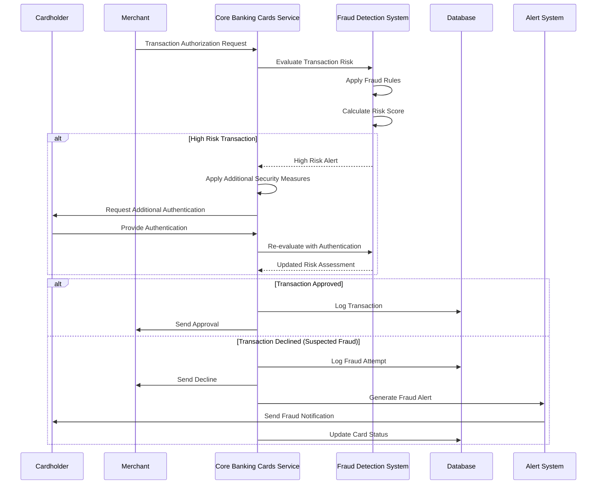
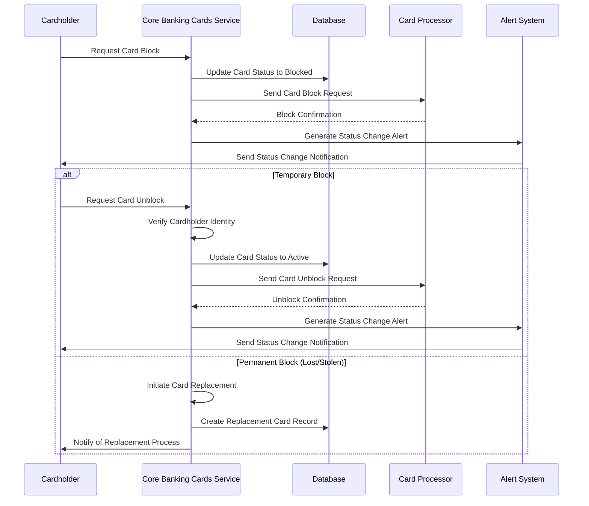

# Card Security

## Overview

Card Security is a critical capability of the Core Banking Cards Service that implements robust security measures to protect card data, detect fraudulent activities, and prevent unauthorized transactions. The service employs multiple layers of security to safeguard cardholder information and maintain the integrity of the payment ecosystem.

## Key Capabilities

- Secure storage and transmission of card data
- Fraud detection and prevention
- Real-time transaction monitoring
- Card status management (block, suspend, reactivate)
- PIN management and security
- 3D Secure implementation for online transactions
- Tokenization for secure digital payments
- Security alerts and notifications
- Compliance with industry security standards

## Security Layers

### 1. Data Protection

Ensures that sensitive card data is securely stored, transmitted, and processed in compliance with industry standards.

### 2. Authentication

Verifies the identity of cardholders through various methods such as PIN, 3D Secure, and biometrics.

### 3. Authorization

Controls transaction approvals based on predefined rules, limits, and risk assessments.

### 4. Monitoring

Continuously monitors card activities to detect suspicious patterns and potential fraud.

### 5. Response

Implements rapid response mechanisms to address security incidents and minimize potential damage.

## Entities Involved

- **CARD**: Central entity with security status and settings
- **CARD_ACTIVITY**: Records of security-related activities
- **CARD_TRANSACTION**: Transactions monitored for fraud
- **CARD_LIMIT**: Security limits applied to transactions
- **CARD_CUSTOMER**: Customer information for authentication

## Process Flow: Fraud Detection and Prevention



## Process Flow: Card Status Management



## Fraud Detection Rules

The Core Banking Cards Service implements various fraud detection rules:

1. **Velocity Checks**: Detects unusual frequency of transactions
2. **Amount Pattern Analysis**: Identifies unusual transaction amounts
3. **Geographic Analysis**: Flags transactions from high-risk locations
4. **Merchant Category Monitoring**: Identifies transactions at high-risk merchant categories
5. **Time-of-Day Analysis**: Detects transactions at unusual times
6. **Device Intelligence**: Monitors transactions across different devices
7. **Behavioral Analysis**: Compares transactions against cardholder's normal behavior
8. **Network Intelligence**: Utilizes card network fraud detection systems

## API Endpoints

| Endpoint | Method | Description |
|----------|--------|-------------|
| `/api/v1/cards/{cardId}/status` | PATCH | Update card status (block, suspend, activate) |
| `/api/v1/cards/{cardId}/pin` | PUT | Update card PIN |
| `/api/v1/cards/{cardId}/security-settings` | GET | Get card security settings |
| `/api/v1/cards/{cardId}/security-settings` | PUT | Update card security settings |
| `/api/v1/cards/{cardId}/alerts` | GET | Get security alerts for a card |
| `/api/v1/cards/{cardId}/alerts` | POST | Create security alert subscription |
| `/api/v1/cards/{cardId}/3d-secure` | POST | Initiate 3D Secure authentication |
| `/api/v1/fraud/rules` | GET | Get fraud detection rules |
| `/api/v1/fraud/analyze` | POST | Analyze transaction for fraud risk |

## Example: Blocking a Card

### Request

```
PATCH /api/v1/cards/9876/status
Content-Type: application/json
```

```json
{
  "status": "BLOCKED",
  "reason": "SUSPECTED_FRAUD",
  "comments": "Multiple high-value transactions in foreign country",
  "blockType": "TEMPORARY",
  "notifyCustomer": true,
  "notificationChannel": "SMS"
}
```

### Response

```json
{
  "cardId": 9876,
  "previousStatus": "ACTIVE",
  "currentStatus": "BLOCKED",
  "statusChangeTimestamp": "2023-06-22T10:15:30Z",
  "reason": "SUSPECTED_FRAUD",
  "blockType": "TEMPORARY",
  "notificationSent": true,
  "notificationChannel": "SMS",
  "notificationTimestamp": "2023-06-22T10:15:35Z",
  "activityId": 12345
}
```

## Example: Updating Security Settings

### Request

```
PUT /api/v1/cards/9876/security-settings
Content-Type: application/json
```

```json
{
  "enableInternationalTransactions": false,
  "enableOnlineTransactions": true,
  "enableContactlessTransactions": true,
  "enableAtmWithdrawals": true,
  "enableRecurringPayments": true,
  "transactionAlerts": {
    "allTransactions": true,
    "transactionsAboveAmount": 100.00,
    "internationalTransactions": true,
    "onlineTransactions": true,
    "declinedTransactions": true
  },
  "alertChannels": ["EMAIL", "SMS"]
}
```

### Response

```json
{
  "cardId": 9876,
  "securitySettings": {
    "enableInternationalTransactions": false,
    "enableOnlineTransactions": true,
    "enableContactlessTransactions": true,
    "enableAtmWithdrawals": true,
    "enableRecurringPayments": true,
    "transactionAlerts": {
      "allTransactions": true,
      "transactionsAboveAmount": 100.00,
      "internationalTransactions": true,
      "onlineTransactions": true,
      "declinedTransactions": true
    },
    "alertChannels": ["EMAIL", "SMS"]
  },
  "updateTimestamp": "2023-06-22T11:30:45Z",
  "activityId": 12346
}
```

## Security Compliance

The Core Banking Cards Service adheres to industry security standards and regulations:

| Standard/Regulation | Description |
|---------------------|-------------|
| **PCI DSS** | Payment Card Industry Data Security Standard for protecting card data |
| **EMV** | Global standard for chip card technology |
| **GDPR** | General Data Protection Regulation for protecting personal data |
| **3D Secure** | Protocol for online transaction authentication |
| **ISO 27001** | Information security management standard |
| **Network Security Rules** | Visa, Mastercard, and other network-specific security requirements |

## Best Practices

1. **Defense in Depth**: Implement multiple layers of security controls
2. **Encryption**: Use strong encryption for data at rest and in transit
3. **Tokenization**: Replace sensitive card data with tokens for digital transactions
4. **Real-time Monitoring**: Implement continuous transaction monitoring
5. **Machine Learning**: Utilize advanced algorithms for fraud detection
6. **Regular Testing**: Conduct security assessments and penetration testing
7. **Incident Response**: Develop and test incident response procedures
8. **Customer Education**: Provide security awareness information to cardholders
9. **Regular Updates**: Keep security systems and rules updated
10. **Compliance Monitoring**: Regularly audit security controls for compliance