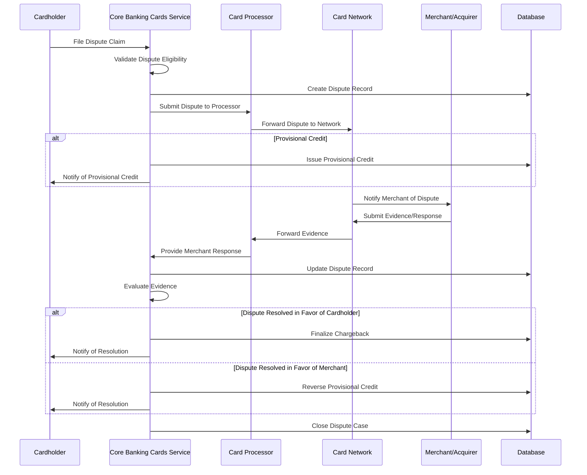

# Dispute Handling

## Overview

Dispute Handling is a critical capability of the Core Banking Cards Service that enables financial institutions to process and resolve transaction disputes raised by cardholders. The service provides end-to-end management of the dispute lifecycle, from initial filing to final resolution, ensuring compliance with card network rules and regulations.

## Key Capabilities

- Process cardholder dispute claims
- Manage dispute lifecycle and status tracking
- Facilitate evidence collection and submission
- Handle chargeback processing
- Support representment (second presentment) processing
- Manage dispute resolution and settlement
- Generate dispute-related notifications and communications
- Provide dispute reporting and analytics
- Ensure compliance with network timeframes and regulations

## Dispute Lifecycle

### 1. Dispute Initiation

The cardholder reports a disputed transaction, and the financial institution captures the dispute details and reason.

### 2. Investigation

The financial institution investigates the dispute, collects evidence, and determines the validity of the claim.

### 3. Chargeback Processing

If the dispute is valid, a chargeback is initiated to recover funds from the merchant.

### 4. Representment (Optional)

The merchant may contest the chargeback by providing evidence that the transaction was valid.

### 5. Arbitration (Optional)

If the dispute remains unresolved after representment, it may proceed to arbitration by the card network.

### 6. Resolution

The dispute is resolved with a final decision, and the appropriate party is credited or debited.

## Entities Involved

- **CARD_DISPUTE**: Central entity for dispute management
- **CARD_TRANSACTION**: The transaction being disputed
- **CARD**: The payment card used for the transaction
- **CARD_CUSTOMER**: The cardholder raising the dispute
- **CARD_MERCHANT**: The merchant involved in the disputed transaction

## Process Flow: Dispute Handling



## Dispute Reason Codes

The Core Banking Cards Service supports standard dispute reason codes defined by card networks:

| Category | Common Reasons |
|----------|----------------|
| **Fraud** | Unauthorized transaction, counterfeit card, card not present fraud |
| **Processing Errors** | Duplicate processing, incorrect amount, late presentment |
| **Consumer Disputes** | Product/service not as described, defective merchandise, credit not processed |
| **Authorization Issues** | No authorization, declined authorization |

## API Endpoints

| Endpoint | Method | Description |
|----------|--------|-------------|
| `/api/v1/disputes` | POST | File a new dispute |
| `/api/v1/disputes` | GET | List disputes with pagination and filtering |
| `/api/v1/disputes/{disputeId}` | GET | Get dispute details by ID |
| `/api/v1/disputes/{disputeId}/status` | PATCH | Update dispute status |
| `/api/v1/disputes/{disputeId}/evidence` | POST | Add evidence to a dispute |
| `/api/v1/disputes/{disputeId}/notes` | POST | Add notes to a dispute |
| `/api/v1/disputes/{disputeId}/timeline` | GET | Get dispute timeline events |
| `/api/v1/cards/{cardId}/disputes` | GET | Get disputes for a specific card |
| `/api/v1/customers/{customerId}/disputes` | GET | Get disputes for a specific customer |

## Example: Filing a Dispute

### Request

```
POST /api/v1/disputes
Content-Type: application/json
```

```json
{
  "cardId": 9876,
  "transactionId": 54321,
  "customerId": 12345,
  "disputeReasonCode": "FRAUD_UNAUTHORIZED_TRANSACTION",
  "disputeAmount": 125.50,
  "disputeCurrency": "USD",
  "cardholderStatement": "I did not authorize this transaction. My card was in my possession at the time.",
  "contactPreference": "EMAIL",
  "evidenceDocuments": [
    {
      "documentType": "CARDHOLDER_STATEMENT",
      "documentUrl": "https://example.com/documents/statement12345.pdf",
      "uploadDate": "2023-06-20T09:15:30Z"
    }
  ]
}
```

### Response

```json
{
  "disputeId": 7890,
  "disputeReference": "DISP20230620123456",
  "cardId": 9876,
  "transactionId": 54321,
  "customerId": 12345,
  "disputeReasonCode": "FRAUD_UNAUTHORIZED_TRANSACTION",
  "disputeAmount": 125.50,
  "disputeCurrency": "USD",
  "disputeStatus": "INITIATED",
  "disputeStage": "FILING",
  "filingTimestamp": "2023-06-20T09:20:15Z",
  "isCardholderCredited": true,
  "creditTimestamp": "2023-06-20T09:20:20Z",
  "creditAmount": 125.50,
  "expectedResolutionDate": "2023-07-20T00:00:00Z",
  "caseNumber": "CASE123456789"
}
```

## Example: Adding Evidence to a Dispute

### Request

```
POST /api/v1/disputes/7890/evidence
Content-Type: application/json
```

```json
{
  "evidenceType": "TRANSACTION_RECEIPT",
  "evidenceDescription": "Copy of the transaction receipt showing signature",
  "documentUrl": "https://example.com/documents/receipt54321.pdf",
  "submittedBy": "MERCHANT",
  "submissionDate": "2023-06-25T14:30:00Z"
}
```

### Response

```json
{
  "evidenceId": 4567,
  "disputeId": 7890,
  "evidenceType": "TRANSACTION_RECEIPT",
  "evidenceDescription": "Copy of the transaction receipt showing signature",
  "documentUrl": "https://example.com/documents/receipt54321.pdf",
  "submittedBy": "MERCHANT",
  "submissionDate": "2023-06-25T14:30:00Z",
  "status": "RECEIVED",
  "reviewDate": null,
  "reviewNotes": null
}
```

## Dispute Resolution Timeframes

The Core Banking Cards Service adheres to standard network timeframes for dispute processing:

| Network | Initial Filing Timeframe | Chargeback Processing | Representment | Arbitration |
|---------|--------------------------|----------------------|---------------|-------------|
| Visa | 120 days from transaction | 30 days | 30 days | 10 days |
| Mastercard | 120 days from transaction | 45 days | 45 days | 15 days |
| Amex | 120 days from statement | 20 days | 20 days | 30 days |

## Best Practices

1. **Documentation**: Maintain comprehensive documentation for all dispute cases
2. **Timeliness**: Adhere to network timeframes for dispute processing
3. **Communication**: Provide clear and timely communication to cardholders about dispute status
4. **Evidence Management**: Implement robust evidence collection and management processes
5. **Fraud Detection**: Integrate with fraud detection systems to identify potential fraudulent disputes
6. **Compliance**: Ensure compliance with network rules and regulations
7. **Automation**: Automate routine dispute processing tasks to improve efficiency
8. **Reporting**: Implement comprehensive dispute reporting and analytics
9. **Training**: Provide training to staff on dispute handling procedures
10. **Quality Control**: Implement quality control processes to ensure accurate dispute resolution