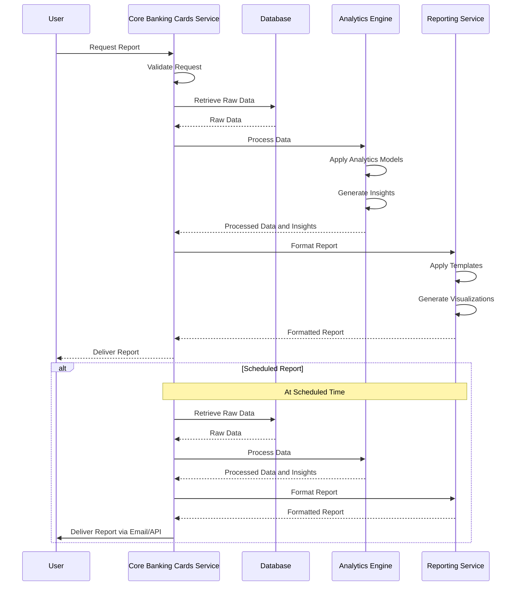

# Reporting and Analytics

## Overview

Reporting and Analytics is a powerful capability of the Core Banking Cards Service that provides comprehensive insights into card usage, transaction patterns, and business performance. The service offers a wide range of reports and analytics tools to help financial institutions monitor card operations, analyze party behavior, identify trends, and make data-driven decisions.

## Key Capabilities

- Generate standard and custom reports on card operations
- Provide real-time dashboards for monitoring key metrics
- Analyze transaction patterns and party behavior
- Track card program performance and profitability
- Monitor fraud patterns and security metrics
- Generate regulatory and compliance reports
- Support business intelligence and data analytics
- Export data in various formats for further analysis
- Schedule automated report generation and distribution

## Types of Reports and Analytics

### 1. Operational Reports

Day-to-day operational reports that provide insights into card issuance, activation, and transaction processing.

### 2. Financial Reports

Reports focused on financial aspects such as revenue, costs, fees, and profitability of card programs.

### 3. Party Analytics

Analysis of party behavior, preferences, spending patterns, and engagement with card products.

### 4. Risk and Fraud Reports

Reports on fraud attempts, suspicious activities, and risk metrics to enhance security measures.

### 5. Compliance Reports

Reports required for regulatory compliance and internal auditing purposes.

### 6. Performance Analytics

Analysis of card program performance, including adoption rates, usage metrics, and party satisfaction.

## Entities Involved

- **CARD**: Card data for issuance and status reporting
- **CARD_TRANSACTION**: Transaction data for financial and behavioral analysis

- **CARD_PROGRAM**: Program data for performance analysis
- **CARD_DISPUTE**: Dispute data for risk and service quality analysis
- **CARD_MERCHANT**: Merchant data for spending pattern analysis

## Process Flow: Report Generation



## API Endpoints

| Endpoint | Method | Description |
|----------|--------|-------------|
| `/api/v1/reports` | GET | List available report types |
| `/api/v1/reports/generate` | POST | Generate a custom report |
| `/api/v1/reports/scheduled` | GET | List scheduled reports |
| `/api/v1/reports/scheduled` | POST | Create a scheduled report |
| `/api/v1/reports/scheduled/{id}` | DELETE | Delete a scheduled report |
| `/api/v1/reports/{reportId}` | GET | Get a specific report |
| `/api/v1/analytics/dashboard` | GET | Get dashboard metrics |
| `/api/v1/analytics/transactions` | GET | Get transaction analytics |
| `/api/v1/analytics/parties` | GET | Get party analytics |
| `/api/v1/analytics/fraud` | GET | Get fraud analytics |

## Example: Generating a Transaction Report

### Request

```
POST /api/v1/reports/generate
Content-Type: application/json
```

```json
{
  "reportType": "TRANSACTION_SUMMARY",
  "parameters": {
    "startDate": "2023-06-01T00:00:00Z",
    "endDate": "2023-06-30T23:59:59Z",
    "cardProgramId": 101,
    "groupBy": ["DAY", "MERCHANT_CATEGORY"],
    "includeDeclined": true,
    "includeDisputed": true
  },
  "format": "PDF",
  "includeCharts": true,
  "includeRawData": false,
  "name": "June 2023 Transaction Summary"
}
```

### Response

```json
{
  "reportId": "REP20230701123456",
  "reportType": "TRANSACTION_SUMMARY",
  "status": "PROCESSING",
  "createdAt": "2023-07-01T10:15:30Z",
  "estimatedCompletionTime": "2023-07-01T10:16:30Z",
  "parameters": {
    "startDate": "2023-06-01T00:00:00Z",
    "endDate": "2023-06-30T23:59:59Z",
    "cardProgramId": 101,
    "groupBy": ["DAY", "MERCHANT_CATEGORY"],
    "includeDeclined": true,
    "includeDisputed": true
  },
  "format": "PDF",
  "downloadUrl": null,
  "notificationEmail": "user@example.com"
}
```

## Example: Creating a Scheduled Report

### Request

```
POST /api/v1/reports/scheduled
Content-Type: application/json
```

```json
{
  "reportType": "CARD_PROGRAM_PERFORMANCE",
  "parameters": {
    "cardProgramId": 101,
    "metrics": [
      "ACTIVATION_RATE",
      "TRANSACTION_VOLUME",
      "AVERAGE_TRANSACTION_VALUE",
      "REVENUE",
      "ACTIVE_CARDS_PERCENTAGE"
    ]
  },
  "schedule": {
    "frequency": "MONTHLY",
    "dayOfMonth": 1,
    "timeOfDay": "01:00:00",
    "timezone": "UTC",
    "startDate": "2023-07-01",
    "endDate": "2024-06-30"
  },
  "format": "EXCEL",
  "recipients": [
    {
      "email": "manager@example.com",
      "name": "Program Manager"
    },
    {
      "email": "analyst@example.com",
      "name": "Business Analyst"
    }
  ],
  "name": "Monthly Card Program Performance Report"
}
```

### Response

```json
{
  "scheduledReportId": "SCH20230701123457",
  "reportType": "CARD_PROGRAM_PERFORMANCE",
  "status": "ACTIVE",
  "createdAt": "2023-07-01T11:30:45Z",
  "parameters": {
    "cardProgramId": 101,
    "metrics": [
      "ACTIVATION_RATE",
      "TRANSACTION_VOLUME",
      "AVERAGE_TRANSACTION_VALUE",
      "REVENUE",
      "ACTIVE_CARDS_PERCENTAGE"
    ]
  },
  "schedule": {
    "frequency": "MONTHLY",
    "dayOfMonth": 1,
    "timeOfDay": "01:00:00",
    "timezone": "UTC",
    "startDate": "2023-07-01",
    "endDate": "2024-06-30",
    "nextExecutionDate": "2023-08-01T01:00:00Z"
  },
  "format": "EXCEL",
  "recipients": [
    {
      "email": "manager@example.com",
      "name": "Program Manager"
    },
    {
      "email": "analyst@example.com",
      "name": "Business Analyst"
    }
  ],
  "name": "Monthly Card Program Performance Report"
}
```

## Key Metrics and KPIs

The Core Banking Cards Service tracks and reports on various key metrics and KPIs:

### Card Program Metrics

- **Card Issuance Rate**: Number of cards issued over time
- **Activation Rate**: Percentage of issued cards that are activated
- **Active Cards Percentage**: Percentage of cards with recent activity
- **Card Lifecycle Metrics**: Time to issue, activate, and first use

### Transaction Metrics

- **Transaction Volume**: Number of transactions processed
- **Transaction Value**: Total monetary value of transactions
- **Average Transaction Value**: Average value per transaction
- **Transaction Success Rate**: Percentage of successful transactions
- **Decline Rate**: Percentage of declined transactions by reason

### Financial Metrics

- **Revenue**: Total revenue generated from card operations
- **Fee Income**: Revenue from various card fees
- **Interchange Revenue**: Revenue from interchange fees
- **Profitability**: Overall profitability of card programs
- **Cost per Card**: Average cost to issue and maintain a card

### Customer Metrics

- **Customer Acquisition Cost**: Cost to acquire a new cardholder
- **Customer Lifetime Value**: Projected value of a cardholder
- **Customer Satisfaction**: Satisfaction scores and feedback
- **Retention Rate**: Percentage of cardholders who renew cards
- **Cross-sell Rate**: Success in selling additional products

### Risk Metrics

- **Fraud Rate**: Percentage of transactions identified as fraudulent
- **Dispute Rate**: Percentage of transactions disputed
- **Chargeback Rate**: Percentage of transactions resulting in chargebacks
- **Loss Rate**: Financial losses due to fraud and disputes
- **Risk Score Distribution**: Distribution of risk scores across portfolio

## Best Practices

1. **Data Quality**: Ensure high-quality data collection for accurate reporting
2. **Real-time Insights**: Implement real-time analytics for timely decision-making
3. **Visualization**: Use effective data visualization techniques for better understanding
4. **Customization**: Allow users to customize reports based on their specific needs
5. **Automation**: Automate routine reporting tasks to improve efficiency
6. **Data Security**: Implement robust security measures for sensitive reporting data
7. **User Training**: Provide training on how to interpret and use reports effectively
8. **Continuous Improvement**: Regularly review and enhance reporting capabilities
9. **Benchmarking**: Include industry benchmarks for comparative analysis
10. **Actionable Insights**: Focus on generating insights that drive business actions